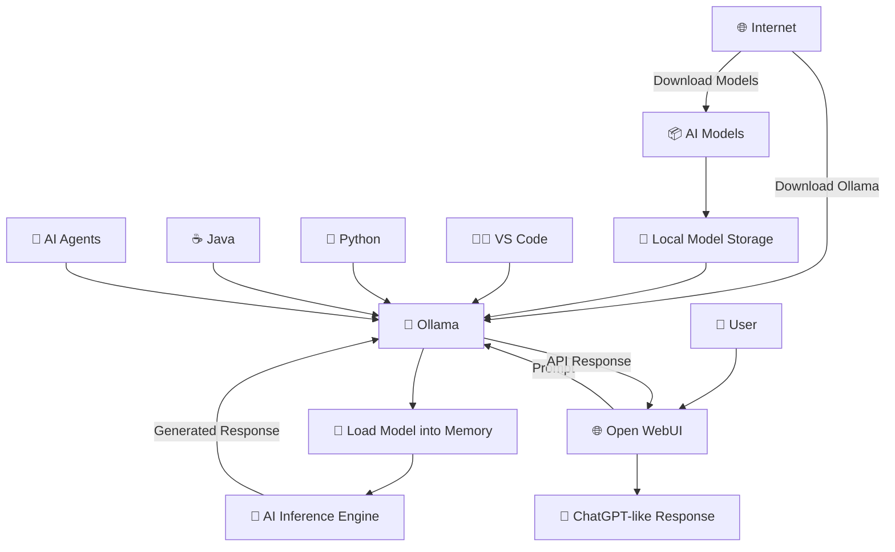

# Ollama Complete Installation & Usage Guide

## What is Ollama?

Ollama is an open-source tool that allows you to download, manage, and run Large Language Models (LLMs) locally on your computer.

Unlike cloud AI services (such as ChatGPT), Ollama allows you to:

* Run AI completely offline
* Keep your data private
* Use different open-source models
* Build AI-powered applications
* Expose a local REST API

---

# System Requirements

| Component        | Minimum                     | Recommended                |
| ---------------- | --------------------------- | -------------------------- |
| RAM              | 8 GB                        | 16 GB+                     |
| Storage          | 10 GB                       | 100 GB+                    |
| CPU              | Modern x64 CPU              | Intel i7/Ryzen 7+          |
| GPU              | Optional                    | NVIDIA GPU with 8 GB+ VRAM |
| Operating System | Windows 10/11, Linux, macOS | Latest Version             |

---

# Step 1 Install Ollama

## Windows

Visit:

**[Ollama Downloads](https://ollama.com/download?utm_source=chatgpt.com)**

Download the Windows installer.

Run:

```
OllamaSetup.exe
```

Click

```
Next
Next
Install
Finish
```

Ollama automatically starts in the background.

---

## Verify Installation

Open CMD or PowerShell

```
ollama --version
```

Example

```
ollama version 0.x.x
```

You can also verify the local server is running by opening:

```
http://localhost:11434
```

If everything is working, you'll see a simple confirmation response from the local API. ([Windows Central][2])

---

## Linux Installation

```
curl -fsSL https://ollama.com/install.sh | sh
```

Start Ollama

```
ollama serve
```

Enable auto-start (recommended)

```
sudo systemctl enable ollama
sudo systemctl start ollama
```

([Ollama][1])

---

## macOS

Download the installer from the Ollama website and install it like any standard macOS application.

---

# Step 2 Verify Installation

```
ollama
```

Example

```
Usage:
  ollama [command]

Commands:

serve
run
pull
push
list
show
create
rm
ps
stop
cp
help
```

---

# Step 3 Download Your First AI Model

Example

```
ollama pull llama3.2
```

or

```
ollama pull qwen3:4b
```

The terminal will display

```
pulling manifest

downloading...

verifying

success
```

---

# Step 4 Run the Model

```
ollama run llama3.2
```

or

```
ollama run qwen3:4b
```

Now chat directly

```
>>> Hello

Hi! How can I help you?
```

Exit

```
/bye
```

---

# Step 5 Pull and Run Together

Instead of

```
ollama pull llama3.2

ollama run llama3.2
```

You can simply use

```
ollama run llama3.2
```

If the model isn't already installed, Ollama automatically downloads it before starting the chat. ([Mintlify][3])

---

# Useful Ollama Commands

## Show Ollama Version

```
ollama --version
```

---

## List Installed Models

```
ollama list
```

Example

```
NAME          SIZE

llama3.2      2 GB

gemma3        3.3 GB

qwen3         5.2 GB
```

---

## Download Model

```
ollama pull llama3.2
```

---

## Run Model

```
ollama run llama3.2
```

---

## Run a Single Prompt

```
ollama run llama3.2 "Explain Docker in simple words."
```

Useful for scripting.

---

## Remove Model

```
ollama rm llama3.2
```

---

## View Model Information

```
ollama show llama3.2
```

Displays metadata such as architecture, parameters, quantization, and template. ([Radxa Docs][4])

---

## Copy Model

```
ollama cp llama3.2 mymodel
```

Useful before creating custom variants.

---

## Create a Custom Model

```
ollama create mymodel -f Modelfile
```

---

## List Running Models

```
ollama ps
```

---

## Stop Running Model

```
ollama stop llama3.2
```

---

## Start API Server

```
ollama serve
```

Normally this is already running automatically on Windows and macOS.

---

## Show Help

```
ollama help
```

---

# Popular Models to Download

General AI

```
ollama pull llama3.2
```

Coding

```
ollama pull qwen3:8b
```

Reasoning

```
ollama pull deepseek-r1:8b
```

Google Gemma

```
ollama pull gemma3:4b
```

Fast Small Model

```
ollama pull phi4-mini
```

Vision Model

```
ollama pull llama3.2-vision
```

---

# Where Models Are Stored

## Windows

```
C:\Users\<username>\.ollama\models
```

## Linux

```
/usr/share/ollama
```

## macOS

```
~/.ollama/models
```

---

# Ollama REST API

Ollama automatically exposes a local API.

Base URL

```
http://localhost:11434
```

Example request

```bash
curl http://localhost:11434/api/generate \
-d '{
  "model":"llama3.2",
  "prompt":"Explain Kubernetes"
}'
```

This API can be used from Python, Java, JavaScript, or any language that can make HTTP requests.

---

# Updating Ollama

Download and install the latest version from the official website, or rerun the Linux install script.

Linux

```
curl -fsSL https://ollama.com/install.sh | sh
```

([Ollama][1])

---

# Uninstalling Ollama

## Remove a Model

```
ollama rm llama3.2
```

## Remove All Models

Delete the models directory.

Windows

```
C:\Users\<username>\.ollama
```

Linux

```
/usr/share/ollama
```
---

# Open WebUI (ChatGPT-like Interface for Ollama)

## What is Open WebUI?

**Open WebUI** is a free, open-source web interface for Ollama that provides a modern ChatGPT-like experience in your browser.

Instead of interacting with AI models through the terminal, Open WebUI offers:

* 💬 Beautiful ChatGPT-like interface
* 🤖 Support for multiple Ollama models
* 📚 Chat history
* 🌙 Dark and Light themes
* 📄 Upload PDFs and documents
* 🖼️ Image upload (for vision models)
* 🔍 Built-in RAG (Retrieval-Augmented Generation)
* 👥 Multi-user support
* 🔌 OpenAI-compatible API support
* 🌐 Access from other devices on your local network

---

# Prerequisites

Before installing Open WebUI, ensure you have:

* ✅ Ollama installed
* ✅ At least one model downloaded
* ✅ Docker Desktop installed (Recommended)

Download Docker Desktop:

[https://www.docker.com/products/docker-desktop/](https://www.docker.com/products/docker-desktop/)

---

# Install Docker Desktop

### Windows

1. Download Docker Desktop.
2. Install it.
3. Restart your computer if prompted.
4. Launch Docker Desktop.
5. Wait until Docker shows **Engine Running**.

Verify installation:

```bash
docker --version
```

Example:

```text
Docker version 28.x.x
```

---

# Pull and Run Open WebUI

Run the following command:

```bash
docker run -d ^
  -p 3000:8080 ^
  --add-host=host.docker.internal:host-gateway ^
  -v open-webui:/app/backend/data ^
  --name open-webui ^
  --restart always ^
  ghcr.io/open-webui/open-webui:main
```

> **Linux/macOS:**

```bash
docker run -d \
  -p 3000:8080 \
  --add-host=host.docker.internal:host-gateway \
  -v open-webui:/app/backend/data \
  --name open-webui \
  --restart always \
  ghcr.io/open-webui/open-webui:main
```

Docker will automatically download the Open WebUI image the first time you run this command.

---

# Open Open WebUI

Open your browser and navigate to:

```text
http://localhost:3000
```

You'll see a ChatGPT-like interface.

---

# Create Your Account

The first time you open Open WebUI:

1. Click **Sign Up**.
2. Create your administrator account.
3. Log in.

> The first account created automatically becomes the administrator.

---

# Verify Ollama Connection

Open WebUI automatically detects Ollama if it is running on the same machine.

If not:

1. Go to **Settings**
2. Open **Connections**
3. Set the Ollama API URL to:

```text
http://host.docker.internal:11434
```

For Linux (if required):

```text
http://localhost:11434
```

Save the settings.

---

# Select a Model

Click the model dropdown at the top of the page.

You'll see all models installed with Ollama, for example:

* llama3.2
* qwen3:4b
* gemma3:4b
* deepseek-r1:8b

Choose a model and start chatting.

---

# Useful Docker Commands

### View Running Containers

```bash
docker ps
```

### View All Containers

```bash
docker ps -a
```

### Stop Open WebUI

```bash
docker stop open-webui
```

### Start Open WebUI

```bash
docker start open-webui
```

### Restart Open WebUI

```bash
docker restart open-webui
```

### View Logs

```bash
docker logs open-webui
```

### Remove Open WebUI

```bash
docker rm -f open-webui
```

---

# Updating Open WebUI

Stop and remove the existing container:

```bash
docker stop open-webui
docker rm open-webui
```

Pull the latest image:

```bash
docker pull ghcr.io/open-webui/open-webui:main
```

Run the installation command again.

Since the data is stored in the Docker volume (`open-webui`), your chats and settings will remain intact.

---

# Features

| Feature               | Supported |
| --------------------- | --------- |
| ChatGPT-like UI       | ✅         |
| Multiple AI Models    | ✅         |
| Chat History          | ✅         |
| File Upload           | ✅         |
| PDF Chat              | ✅         |
| Image Upload          | ✅         |
| Dark Mode             | ✅         |
| Local Execution       | ✅         |
| Offline Usage         | ✅         |
| Multi-user            | ✅         |
| OpenAI Compatible API | ✅         |

---

# Overall Architecture


---

# Troubleshooting

## "ollama is not recognized"

Restart your terminal after installation or ensure Ollama is in your system `PATH`.

## Model Download Fails

* Check your internet connection.
* Verify the model name matches the one in the Ollama library.
* Retry using `ollama pull <model>`.

## "Address already in use"

Another Ollama instance may already be running. Stop the existing process or restart your machine.
